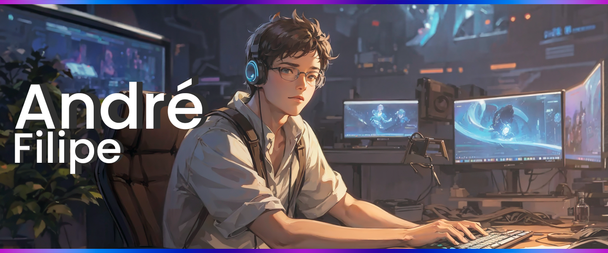

# Bem-Vindos ao meu GitHub! 

## Sobre mim 

-  Olá! Meu nome é André Filipe e sou Desenvolvedor Full Stack.  
-  Meu objetivo atual é realizar uma transição profissional para, no futuro, me tornar um Tech Lead.  
-  Meus skills principais são HTML, CSS, JavaScript, TypeScript, Angular e Node.js  
-  Sou uma pessoa calma, dedicada e focada, apaixonada por café. Tenho facilidade em me comunicar e estou sempre em busca de oportunidades para aprender e evoluir.  
-  Quer conversar sobre tecnologia, games ou gestão? Estou sempre aberto para trocar ideias, então envie uma mensagem!

 

## Skills 

    
 
    

 

 

    <a href="https://github.com/andrefods1993">
    
    

### Obrigado pela visita! 

